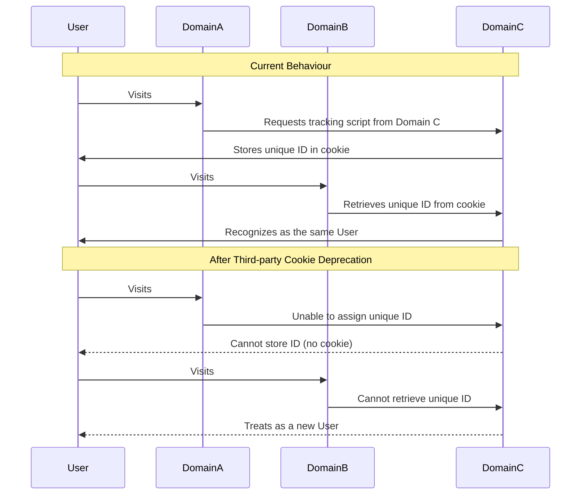
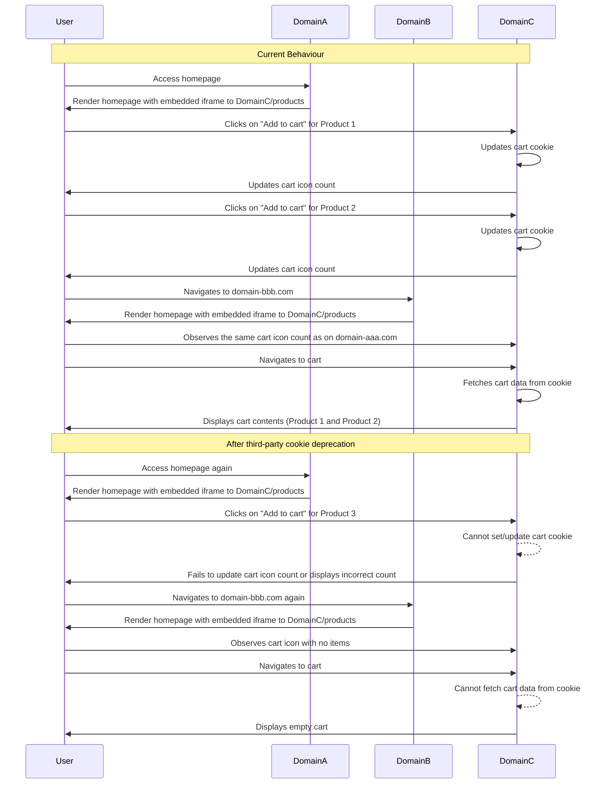
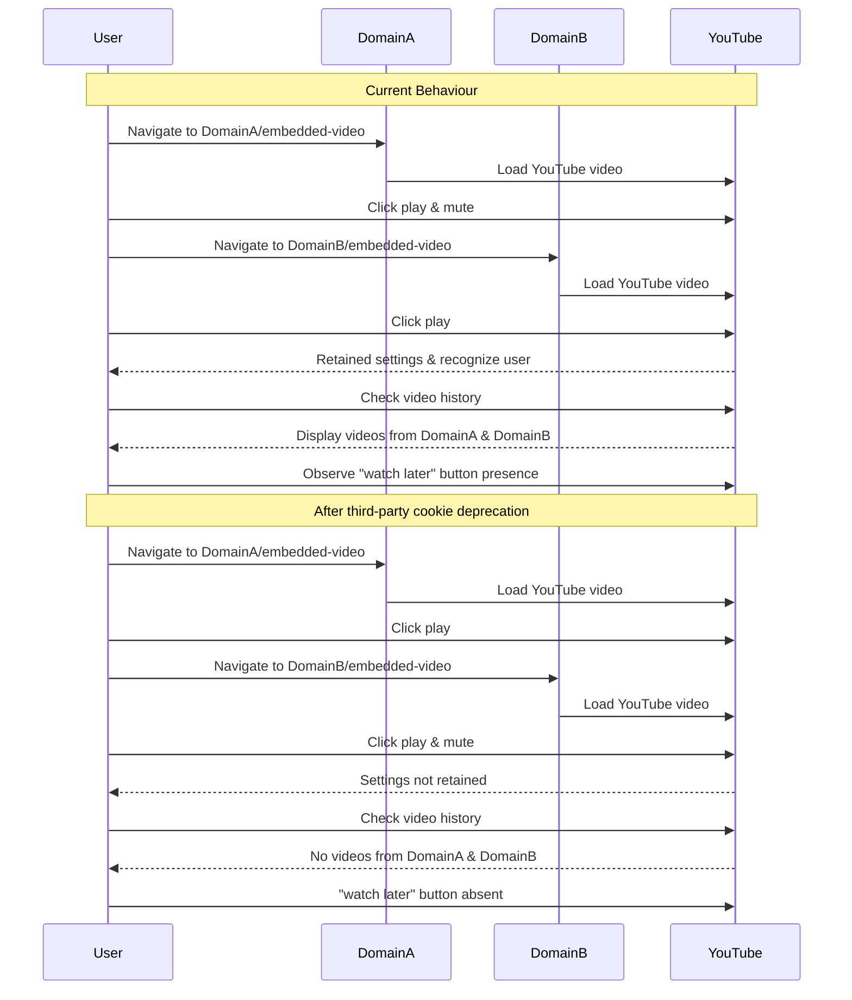
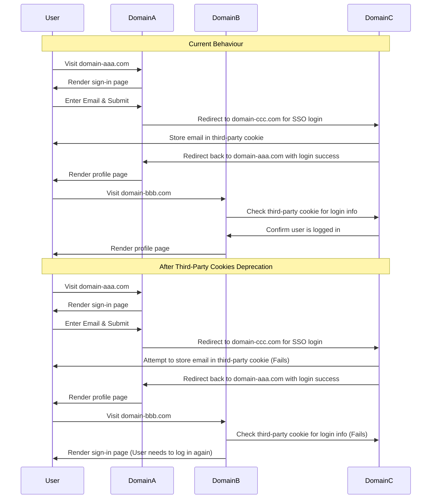

# Privacy Sandbox Demos

Privacy Sandbox Demos is a web application that showcases various demos and scenarios related to privacy sandbox.

## Description

Privacy Sandbox Demos is a web application built using Node.js and Express. It demonstrates different privacy-related
technologies and scenarios through various demos and use cases.

The project is structured into two main sections:

1. **Demo Types**: These are categorized demos, each showcasing a specific privacy sandbox technology.
2. **Scenarios**: These demos represent real-world scenarios where privacy technologies can be applied.

## Getting Started

### Prerequisites

Before you can run the Privacy Sandbox Demos, make sure you have the following software installed:

- [Node.js](https://nodejs.org/)
- [npm](https://www.npmjs.com/) (Node Package Manager)

### Installation

1. Clone this repository to your local machine:

    ```bash
    git clone https://github.com/rtCamp/privacy-sandbox-demos.git
    ```

2. Navigate to the project directory:

    ```bash
    cd privacy-sandbox-demos
    ```

3. Install project dependencies:
    ```bash
    npm install
    ```

## **Configuration**

The project uses environment variables for configuration. You can configure the following variables in a **`.env`**
file:

- **`protocol`**: The protocol used for the application (e.g., **`http`** or **`https`**).
- **`domain-a`**: The domain A for your application.
- **`domain-b`**: The domain B for your application.
- **`domain-c`**: The domain C for your application.
- **`port`**: The port number on which the server will run.

_You can use `localhost` for the domains if you are running the application locally._

## **Usage**

To run the Privacy Sandbox Demos application, use the following command:

```bash
npm start
```

The application will be accessible at **[http://localhost:yourport](http://localhost:yourport/)**, where **`yourport`**
is the port number specified in your environment configuration.

## **Demo Types**

### **CHIPS**

This demo showcases the use of **CHIPS** (**C**ookies **H**aving **I**ndependent **P**artitioned **S**tate) to store
cookies as partitioned cookies tied to the top-level site where it's initially set.

## **Scenarios**

### **Analytics - Cross-Domain Tracking**

This demo showcases the ability to track user interactions using third-party cookies when third-party services are
utilized. The demo consists of three domains - a first-party domain utilizing a third-party service, another first-party
domain also utilizing the third-party service, and the third-party analytics service domain.

**Domain Information**

* **domain-aaa.com**: The first-party domain using the third-party service.
* **domain-bbb.com**: Another first-party domain using the third-party service.
* **domain-ccc.com**: The third-party analytics service domain.

**Sequence Diagram**



### **E-Commerce - Cross-Domain Shopping Cart**

This demo showcases the use of third-party cookies to store shopping cart information across domains while
utilizing a third-party ecommerce service. The primary goal is to test whether third-party ecommerce services can
still use third-party cookies to manage cart information across different domains.

**Domain Setup**

* **domain-aaa.com** - First-party domain utilizing the third-party ecommerce service.
* **domain-bbb.com** - Another first-party domain also utilizing the third-party ecommerce service.
* **domain-ccc.com** - The third-party ecommerce service domain.

**Sequence Diagram**



### **Embedded Content - Cross-Domain Embedded Content**

This demo is designed to showcase the behavior of third-party cookies within embedded content across different domains.
We use an embedded YouTube video as an example of third-party content. The demonstration helps users and developers
understand how third-party cookies function when interacting with content embedded from other domains.

**Domains Used:**

* **domain-aaa.com**: A first-party domain where the third-party service is being utilized.
* **domain-bbb.com**: Another first-party domain where the third-party service is being utilized.

**Sequence Diagram**



### **Single Sign-On - Cross-Domain Single Sign-On**

This demo showcases a basic implementation of a Single Sign-On (SSO) scenario where third-party cookies are used to
share login information across different domains.

**Domains Used:**

* **domain-aaa.com** - The first party domain using the third party service.
* **domain-bbb.com** - Another first party domain using the third party service.
* **domain-ccc.com** - The third-party single sign-on service.

**Sequence Diagram**


